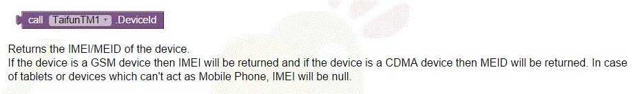

#Tutorial 2 - Prep Notes
Build a lecture “roll call” application.
Students have free reign as to how it works.

##What we provide for the student - MARKS IDEA
We would build a code module that presented a simple “check-in” method they were able to wire up.
Code module would just take a string that would be the “key” that they formulate somehow.
_Mark would have them just make a call with the required info to a web-service_
_My thoughts:  This might make things too simple_

##Marking Notes
Extra points to students who can design something that can’t be cheated (i.e. a student taking a photo of the QR code and emailing it to their friend who isn’t in the theatre so they can “check-in” from home).

###Development notes for tutor:
####TinyDB
Tutor should be aware of tinyDB and how that works.  Many students will likely use this in some way.
**_//TODO:  tinyDB tutorials_**

####Fusion tables
#####Setup:
[here](https://docs.google.com/document/d/1HifuZqz5xu0KPS-e4oUv-t-nQoUQ8VMNyh_y6OjZkc0/pub)
*Note: the notes on this page are out of date with the functionality of the site_ - you may need to walk students through this bit at one stage - when adding the service account select the role as project owner as that will give you all access rights*

If you need to get back to the IAM & Admin page, you can find it by going to [developer console](https://console.developers.google.com) and selecting IAM & Admin from the menu at the upper left.   Then select either Service Accounts or Permissions to see the email address (service account id).
password for your key for the fusion table is defaulted to "notasecret"

hint:  the .p12 file is the API key you need to upload to the app inventor
**_In the app inventor space, you get an error when trying to upload the .p12 key file to the pizza_party project app when you are on the uni wifi.  Works at home on wifi - Works on uni computers.  Does not work on Uni Wifi. Tested 19/12/2016_**

hint:  you need to setup a fusion table in google drive and connect it.  I'm assuming it would be best to ensure its created with the same associated google account as the MIT app (this has not been tested, but is an assumption - did not see info about this on google)

*Note: Instructions about table creation (create an empty or import one) are not 100% clear for this tutorial.  They should choose "create a new one"*

*Note:  When it comes to fusion tables, when the students are "sharing" it, the email address for the service account can be found in the IAM & ADMIN, service accounts section.*

#####Write:
Tutor should checkout the app for [pizza_party](http://explore.appinventor.mit.edu/ai2/pizzaparty)
It uses fusions tables, and writes to them.  It might be useful as a "roll"
Fusion tables:  require additional setup and API access to use these - see
*Note:  App Inventor seems to write to fusion tables, see if you can get it to read from fusion tables*

#####Read
You can read from a fusion table, but the information/examples on how to do this well is a bit lacking.  See Puppy_Potty screen two for different ways of reading from the fusion table.
*Note:  It is easy to view an entire table using the web-viewer and setting the table URL - See Screen 2 of Puppy_Potty*
*Note:  you can setup charts which can be viewed using the web-viewer*
#####Query
You can query the fusion tables.  It is easier to query using SQL queries that using the get rows with conditions function.  
see example of queries from the Roll_Call App

#####Charts
When adding charts to fusion tables, some may be greyed out because you do not have data which can be viewed in that manner.

#####Privacy
*Privacy for the fusion tables?  Can you make it so that only students from the course have access to the table?

Maybe:  but this would take a while to administer.  You do it through the tools/publish options - pretty much like
google sharing... to lock down for a course, you would need the google id for all users in the course.  It would also require the students to use a google login account, and I'm unsure if the MIT app has that feature (internet license) available.
_//TODO:  find out if the MIT app can allow an internet license login feature*

**_My Thoughts:  This is probably a bit too much to have them thinking about at this stage_**

####Clock
Is the clock recording time correctly???

See application puppy_potty.  When using the clock from the AI Companion - it seems to be okay and records time correctly.  When using the clock from the published version - records 00:00:00.  Test some more.

How Bizarre.  I made no changes to the app.  Simply logged in and re-built and now the .apk is sending the correct clock information.  Naturally I'm happy its working, but there is no reason I can think of for the difference in behaviour.
Stranger still - its only actually recording AM entries, Everything is going over as AM.  
**_//TODO - Work out how to fix this._**

Clock- trying to log an instance or time and check if it is in range of the time the lecture is on.  This is not working as well as desired.   
**_//TODO - look into why this one is not working_**

####WebViewer
Using the web-viewer to review a fusion table does not seem to work.  It is not working in the pizza_party App.  Spent quite a while looking into why and have now tested on 4 different fusion tables.  Pretty sure something odd is going on.
**_//TODO:  Need to find why its not displaying the details from a fusion table._**

####GPS
use GPS as a way of saying, “the lecture is at these co-ordinates, and I’m at these co-ordinates, so “check-in”.
Tasks:  
1. set the co-ordinates of the lecture (needs some kind of admin) -- or use global co-ords
2. set a timeframe where users can add their name to the "roll" from their phone
3. cannot add a name more than once from a phone.

**//TODO:  mark will add GPS for emulator**

**_//TODO:  I've noticed with the GPS module that the co-ordinates it finds for me are a couple of blocks away...   needs more testing, but this might not be as accurate as we need**

##QR code
You might use QR Code – perhaps the lecturer would put a code up the screen and the students would snap a photo of the code and that is the key to “check-in”.

Possible issue they may need to address:  What happens if a student takes a photo of the code?  Can they send to someone not at the lecture who can then scan - should they incorporate a secondary check on the student, such as IMEI or GPS or other?

*Note:  There does not seem to be a tutorial about the QR code that I can see.  I did find this: https://www.youtube.com/watch?v=9WdZ88YL_qw
Use this as the tutorial:  http://appinventor.pevest.com/?p=1086*

Common Error with this feature:  "Error 1501 - your device does not have a scanning application installed"
Easy way to solve:  download a Barcode Scanner app from the PlayStore
MIT tutorial video recommends:  https://play.google.com/store/apps/details?id=com.google.zxing.client.android&hl=en

*Marking Note:  People using this feature - their design will need to factor in that students should install a barcode scanner application before using their app.*

####Getting a cell id / IMEI
#####Option 1:  Using the TaifunTM.aix

#####IMPORTANT
This will only work for cell phones, students with tablets will not be able to login if this is used alone.
Students who have this feature, but do not have this limitation account for or noted in their design should lose a couple of marks.

To use this feature - you need to download and setup the telephony extension package.
https://puravidaapps.com/telephonymanager.php
Get the aix file:  TaifunTM.aix

Load into your project:
Use the Import extension tool (bottom of the menu from inside your project designer page)

#####Option 2:  Using the provided module from Mark

**_//TODO:  Update your stuff to use Marks generator_**

####WebServices
Make sure you look at the web-services for MIT stuff and see how that goes.  We may build our own
web service that they can connect to, and they just have to make the call to the service.

**_//TODO: Ask Mark if he is happy to make up the web-service so you can have a play with it.  Let him know you think this option might be too simple_**

####Emulator
Bluetooth, gps, wifi, none of these work in the Emulator
**_//TODO:  emulator not working on uni computers, mark is looking into it._**

####wifi
If on the uni network, use the private IP address as the key to the servelet at the webserver

####Bluetooth
Maybe the lecutuer can get the UID of all devices in the bluetooth range.

####Giroscope
Maybe they need to make some kind of action with the phone to generate the string

#####options
non-persisted field to type in the student number - or some kind of persisted field.

####Control:
In the do-while loops (or while do loops...) - do not leave the do-blocks empty for do nothing.  This causes issues with infinite loops.  Note:  Logic may become cumbersome as you have to have something in here to work.

####Marks notes
They need to be doing most of the work themselves.
They can use third party extensions if they want to.  But they might need a conversation
about the caveats of downloading third party code of the internet.

#####Workshop notes on how to setup things on the uni computers - and get an emulator running and an app started.
**//TODO:  Get this working - make a simple app with a button in the browser on the uni computer... turn off the proxy... fire up the emulator (ai starter - in the folder MIT appinventor tools) and test that it works.  Button will just go to a display message**

#######Issues with the ai2 emulator on the uni computers
Go into firefox --->   go to ai2 (must do this first) - login and get setup (i.e:  GO into the project)
Start up the aiStarter on the uni computer
Then in firefox turn the proxy off
    get notes from google on how to do this
    Then fireup the emulator
    hint:  turn proxy off just as you are firing up the emulator

Note:  Logged in as my student ID - I cannot get this to work on firefox.
trying chrome

#####Bluetooth
Can you get details from all devices in the bluetooth range of one device (TRICKY!!!! -- might not work well).

#####FILE download
http://puravidaapps.com/filedownload.php
See your roll_call using a google drive doc to share.

**//TODO:  Ask Dylan if there is budget to get android phones, we are having hell trying to get the emulator running on the student computers with our staff profiles -- if this happens, need to test uni computers with USB connection to the phone**

**//TODO:   Mark is going to write the module which will act as a fusion table.**

**Find out from Dylan how many tutorials will be ours to give our info - and how many will be his for his info?   we are trying to plan how the content will fall and what we should do**.

**IS it possible to include a couple of "open - assignment - work on stuff tutorials for the students"
