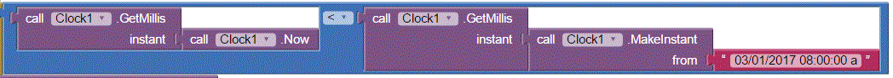

#Tutorial 2

Now that you're becoming more familiar with MIT app inventor, its a good idea to spend some time learning some of the different android features you can use with this tool.  In this tutorial sheet, you will find some notes and quicklinks to assist with learning different features.  

##Sensors
In this section, we will take a look at some of the sensors provided on an android phone.  The sensors that MIT app inventor support are the
*  accelerometer
*  barcode scanner
*  clock
*  gyroscope sensor
*  location sensor
*  near field
*  orientation sensor
*  pedometer
*  proximity sensor

In software engineering, when you are using a platform developed by another entity, the software will most likely be supported by documentation with details about the functionality available for the library.  The documentation for the MIT app inventor sensors can be found [here](http://ai2.appinventor.mit.edu/reference/components/sensors.html).  Its a good idea to ask your tutor about platform documentation, so they can take you through how to use it, and what you should pay attention to.

###Accelerometer
The accelerometer is a component which can detect shaking, and measure acceleration in three dimensions (x, y and z).

An MIT Tutorial using the accelerometer can be found [here](http://explore.appinventor.mit.edu/ai2/magic-8-ball):

####For students using the emulator
Note that this feature is not available for students using the emulator.
**_//TODO:  ask Mark/Dylan if we need to add this one to the tix package built by Mark - I'm not sure groups will use this feature, but who knows what they come up with._**

###Barcode Scanner
The barcode scanner can be used for scanning both regular barcodes or QR codes.

Note that at this time, there is no MIT tutorial on this feature.  However, another detailed tutorial for this feature can be found [here](http://appinventor.pevest.com/?p=1086*)

####Generating a QR code
You can generate QR codes from [this](http://www.qrstuff.com/) site.
1.  Select Plain Text
2.  Type in the text you wish to embed into the QR code
3.  Select the colour
4.  Download your QR code and save the file for scanning

####Dependencies:
When using this feature with a device, you will need to ensure that the activity starter is included (from your design page)

Your device will also require a barcode scanner application from the PlayStore.  We can recommend [this](https://play.google.com/store/apps/details?id=com.google.zxing.client.android&hl=en) application.

Note that when using this feature, a common Error is:  "Error 1501 - your device does not have a scanning application installed".  If you receive this error, please ensure you have installed a barcode scanning application.

####For students using the emulator
Note that this feature is not available for students using the emulator.
**_//TODO:  ask Mark if he can add this to the library and we'll provide emulator notes for it from the different library_**

###Clock
All android phones come with an internal clock.  The clock library offered by MIT app inventor allows you to get and set instances in time or make use of its timer component.

MIT Tutorials using the timer or instance in time component can be found [here](http://explore.appinventor.mit.edu/ai2/tutorials?field_tutorial_type_tid%5B%5D=74):

Note:  The MIT tutorials do not cover an example of comparing one time instance against another.  
Students may wish to note that the following sample of code allows you to compare one time instance against another.

**How does this work?**
All clocks in UNIX systems are set from the initial UTC time of 00:00:00 - 01/01/1970.
The MIT app inventor allows you to convert any instance in time to the number of milliseconds which have passed since this initial time.  The number of seconds which have passed will be represented as an integer.  From here, you can run an integer comparison (using the math library comparison function) to find the relation between any two instances in time.

####For students using the emulator
**_//Test this feature on the emulator - if it doesn't work - we may need to add this to Marks library**

###Gyroscope Sensor
The gyroscope sensor can measure angular velocity in three dimensions in units of degrees per second.
**_//there are no tutorials from MIT on using this sensor - to self - you still need to find one or make up your own_**

####For students using the emulator
Note that this feature is not available for students using the emulator
**_//TODO:  get advice from Dylan/Mark - should we be adding support of this one to the library?**

###Location Sensor
Android phones come with a location sensor.  Using this sensor, it is possible to find the GPS co-ordinates of a device.

MIT tutorials using the location sensor can be found [here](http://explore.appinventor.mit.edu/ai2/tutorials?field_tutorial_type_tid%5B%5D=75&field_tutorial_type_tid%5B%5D=91):

####For students using the emulator
Note that this feature is not available for students using the emulator.  

However, we have provided a library which can be used, and will generate dummy longitude and latitude co-ordinates, so that students using the emulator can still play with this feature.
**_//TODO:  Provide a link to the notes on installing this library for use**
**_//TODO:  Provide some instructions on this feature will work for students using this library, and that these are "dummy" results, so it should trigger their error handling_**

###Near Field Sensor
This sensor enables two electronic devices, to establish communication by bringing them within 4cm of each other.
An MIT tutorial about this sensor can be found [here](http://explore.appinventor.mit.edu/ai2/cup-game)

###Orientation Sensor
The orientation sensor will determine the phone's spatial orientation.
MIT tutorials for the use of this sensor do not exist.  A youTube tutorial featuring the orientation sensor can be found [here](https://www.youtube.com/watch?v=MM1LlE6RveE)

####For students using the emulator
Note that this feature is not available for students using the emulator.
**_//TODO:  get advice from Dylan/Mark - should we be adding support of this one to the library?**

###pedometer
pedometer activities can be tracked using an android device.  The pedometer senses motion via the accerlerometer and attempts to determine if a step has been taken. Using a configurable stride length, it can also estimate the distance travelled.

Note that at this time, there is no MIT tutorial on this feature.  However, another detailed tutorial for this feature can be found [here](http://appinventor.pevest.com/?p=1511)

####For students using the emulator
Note that this feature is not available for students using the emulator.
**_//TODO:  get advice from Dylan/Mark - should we be adding support of this one to the library?**

###proximity sensor
This sensor defines the proximity of an object relative to the device screen.  Most proximity sensors are simply light sensors that will detect "proximity" when they are covered.
Note that this feature is not available on all android devices.
There is no MIT tutorial on this feature, however, a simple youTube tutorial can be found [here](https://www.youtube.com/watch?v=TsmJNo5W4jU)
**Use of this sensor is not recommended during this course**

##Other Useful Features
Apart from the android sensors, there are some other useful features which you might find helpful during this course.

###Getting a cell id / IMEI
Every mobile phone has a unique identification International Mobile Equipment Identity code associated with it, known as the IMEI code.
Obtaining this code from a phone is relatively simple, and may assist you with the design of your application.
**_//TODO:  Provide a link to the notes on installing this library for use**
**_//TODO:  Provide some instructions on this feature will work for students using this library, and that these are "dummy" results, so it should trigger their error handling_**

###Data Storage and Sharing
You may find that you need to store data or share it for your application to work. The ai2 platform offers a couple of libraries which will help with data storage.  The documentation about these libraries can be found [here](http://ai2.appinventor.mit.edu/reference/components/storage.html)

####TinyDB
Androids TinyDB is able to provide persistent local storage of data for an application.  That is, data elements written to the tinyDB can be made available everytime you open a built application.  This database is local to the phone.

An MIT tutorial using TinyDB can be found [here](http://explore.appinventor.mit.edu/displaying-maps)

**_//tODO:  check - but don't think this will work with the emulator_**

###File
The MIT app inventor platform provides a file library which will enable you to write files locally to a phone.
There is no MIT tutorial on this feature, however, a simple youTube tutorial can be found [here](https://www.youtube.com/watch?v=YbIwITeex5s)

**_//tODO:  check - but don't think this will work with the emulator_**

###Fusion tables
The MIT app inventor platform provides a library which will enable you to write data to a fusion table.  A fusion table is a cloud based storage spreadsheet.

**This is an advanced feature and use of this feature is not recommended during this course**

###FILE sharing
The MIT app inventor support file sharing.  That is, sharing a file or text message through another phone application such as gmail, or messenger.

An MIT tutorial about file sharing can be found [here](http://explore.appinventor.mit.edu/ai2/tutorials?field_tutorial_type_tid%5B%5D=93)

**_//tODO:  check - but don't think this will work with the emulator_**

###File download
Cloud based files can be downloaded using the web component.  More details about the web component library can be found [here](http://ai2.appinventor.mit.edu/reference/components/connectivity.html#Web)

There is no MIT tutorial on this feature, however, a simple tutorial can be found [here](http://puravidaapps.com/filedownload.php)

Note that this tutorial works for a cloud based image.  For this to work with a web-based file, you will need to have a file stored in the cloud, which has sharing rights so that it can be downloaded.  Simple use the sharing link for the file in the web1 URL.

**_//tODO:  check - but don't think this will work with the emulator_**
